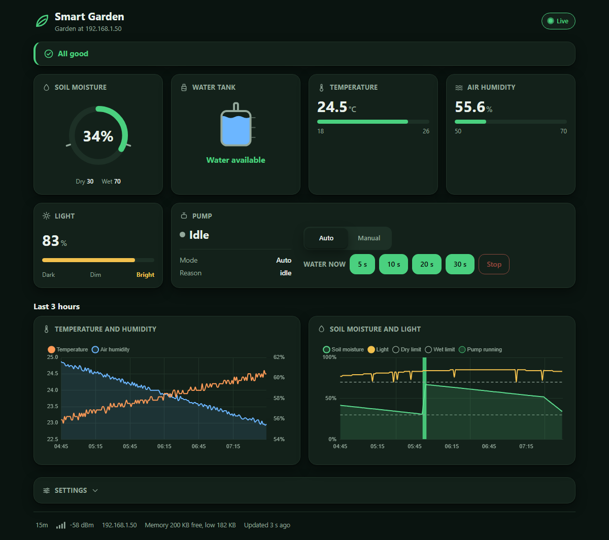
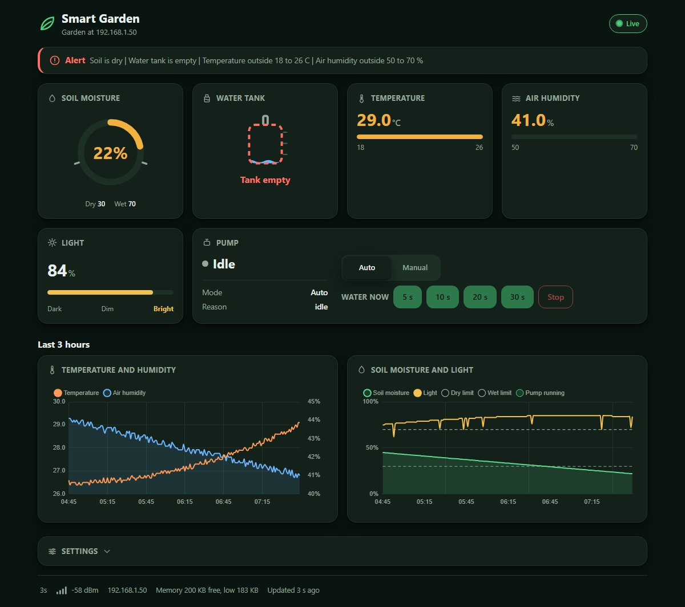
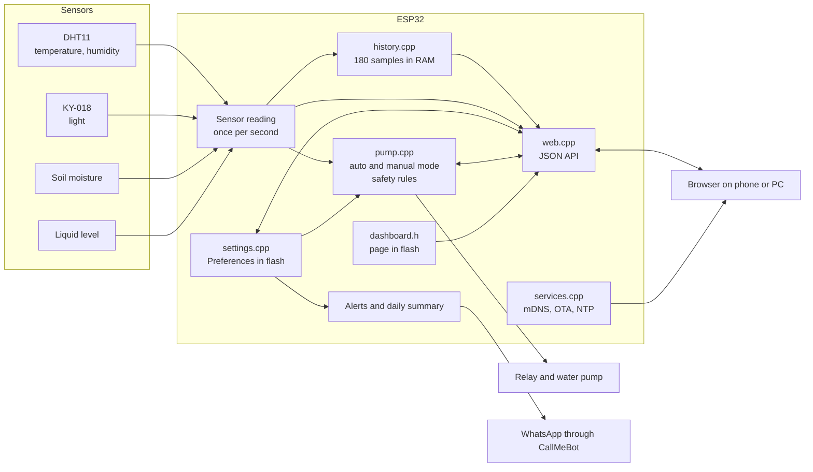

# Smart Garden: IoT garden with an ESP32

This is our project for the Integrated Project subject of the CTeSP in Informatics at AESM. An ESP32 watches a plant with several sensors, waters it automatically with a relay-controlled pump, sends WhatsApp alerts when the conditions are bad and serves a live web dashboard with charts, pump controls and editable settings. The project is called "Horta IoT com Arduino: supervisão automatizada para plantas saudaveis" in our project report.



The picture is the real dashboard page of the sketch, rendered by a browser against the mock device in `tools/preview` (see [Try the dashboard without the board](#try-the-dashboard-without-the-board)). The second picture shows the same page when the tank is empty and the readings are out of range:



## Features

- Measures air temperature and humidity (DHT11), light intensity, soil moisture and whether there is water in the tank.
- Starts the pump when the soil is dry and stops it when the soil is wet enough. The limits are 30 % and 45 % by default and can be changed on the dashboard.
- Protects the pump: it stops when the tank is empty, when the soil sensor gives an invalid value and after a maximum run time (30 s by default), followed by a pause (60 s by default).
- Live web dashboard at `http://smart-garden.local` (or the IP address): status cards with gauges and colours for ok, warning and alert, charts of the last 3 hours, pump state, uptime, Wi-Fi signal and free memory. The page updates itself every 3 seconds, there is no page reload. It follows the light or dark theme of the device and works on a phone.
- Manual pump control from the dashboard: automatic or manual mode and timed runs of 5 to 30 seconds. The safety rules always apply (empty tank, maximum run time).
- Thresholds, pump limits and the daily summary are edited on the dashboard, checked by the board and saved in flash (`Preferences`), so they survive a restart.
- WhatsApp alerts through CallMeBot: temperature or air humidity outside the limits, empty tank, broken soil or DHT11 sensor and pump safety stop. Each alert is sent once per event and is retried if the message could not be delivered.
- Optional daily WhatsApp summary (minimum, maximum and average temperature, average soil humidity, pump run time).
- Over-the-air firmware updates with ArduinoOTA, protected by a password.
- JSON API (`/api/readings`, `/api/history`, `/api/settings`, `/api/pump`) that the dashboard uses and that other tools can use too.
- Keeps working without Wi-Fi and reconnects on its own when the network comes back.
- Runs in the Wokwi simulator, so it can be tried without any hardware (see [Simulation with Wokwi](#simulation-with-wokwi)).
- GitHub Actions compiles the sketch for the ESP32 and checks the dashboard and the API on every push.

## Architecture



## Hardware

| Part | Notes |
| --- | --- |
| ESP32 development board | Any ESP32 DevKit (ESP32-WROOM-32) |
| DHT11 | Temperature and air humidity |
| KY-018 | Light sensor (LDR), analog output |
| Soil moisture sensor | Analog output |
| Contactless liquid level sensor | Digital output, HIGH when there is water |
| Relay module | Switches the pump, active HIGH |
| Water pump and tank | Powered through the relay |

### Wiring

| ESP32 pin | Component |
| --- | --- |
| GPIO18 | DHT11 data |
| GPIO19 | Relay input (water pump) |
| GPIO34 | KY-018 light sensor, analog output |
| GPIO35 | Contactless liquid level sensor, digital output |
| GPIO32 | Soil moisture sensor, analog output |
| 3V3 | Sensor supply (analog sensors must not output more than 3.3 V) |
| GND | Common ground for sensors, relay and the pump supply |

The pump has its own power supply and is only switched by the relay contacts.

## Software requirements

- Arduino IDE or arduino-cli.
- Board package: **esp32 by Espressif Systems** (Boards Manager), board "ESP32 Dev Module" (`esp32:esp32:esp32`). The default partition scheme is fine and leaves room for over-the-air updates.
- Libraries (Library Manager):
  - **DHT sensor library** by Adafruit (it also asks for Adafruit Unified Sensor).
  - **UrlEncode** by plageoj.
- `WiFi`, `WebServer`, `HTTPClient`, `ESPmDNS`, `ArduinoOTA` and `Preferences` come with the ESP32 board package.
- The dashboard loads Chart.js from a CDN, so the browser needs internet access for the charts. Everything else works on the local network alone.

## Setup

1. Open `firmware/esp32_smart_garden/esp32_smart_garden.ino` in the Arduino IDE. The folder name must stay equal to the sketch name.
2. Create the local configuration file. In the sketch folder, copy `secrets.example.h` to `secrets.h` and fill in your values:

   ```cpp
   #define WIFI_SSID "your Wi-Fi network name"
   #define WIFI_PASSWORD "your Wi-Fi password"
   #define WHATSAPP_PHONE "+351912345678"   // country code and number
   #define CALLMEBOT_API_KEY "your CallMeBot key"
   #define OTA_PASSWORD "password for over-the-air updates"
   ```

   `secrets.h` is ignored by git and must never be committed.
3. Get a CallMeBot API key:
   1. Add the CallMeBot WhatsApp number shown at <https://www.callmebot.com/blog/free-api-whatsapp-messages/> to your phone contacts.
   2. Send it the message `I allow callmebot to send me messages` on WhatsApp.
   3. CallMeBot answers with your API key. Put it in `secrets.h` together with your phone number.
4. Select the board and port, then upload over USB the first time.
5. Later updates can go over Wi-Fi: after the first upload the board appears as a network port called `smart-garden` in the Arduino IDE. The IDE asks for `OTA_PASSWORD`.

### Calibration

The soil humidity is computed from the sensor voltage with two constants in `config.h`, `soilVoltageDry` and `soilVoltagePerPercent`. They depend on the sensor, so check the values on the Serial monitor with the sensor in dry and in wet soil and adjust them.

## Run

1. Open the Serial monitor at 9600 baud. The board prints its IP address once it is connected to Wi-Fi.
2. Open `http://smart-garden.local` or `http://<ip address>/` in a browser on the same network.
3. Every second the Serial monitor shows the readings and the actions of the pump.

### The dashboard

| Area | What it shows or does |
| --- | --- |
| Status banner | All good, needs attention or alert, with the reasons (dry soil, empty tank, temperature or humidity outside the limits, sensor not answering, pump paused) |
| Cards | Soil moisture gauge with the dry and wet limits, water tank level, temperature, air humidity and light |
| Pump | State, mode, reason, Auto or Manual switch, "Water now" buttons (5 to 30 s) and a stop button. Disabled when the tank is empty |
| Charts | Temperature and humidity, and soil moisture with light, the dry and wet limits and the times the pump ran |
| Settings | Soil limits, pump run and pause times, temperature and humidity limits, daily summary. Saved in flash |
| Footer | Uptime, Wi-Fi signal, IP address, free memory, time of the last update |

### JSON API

| Route | Method | Use |
| --- | --- | --- |
| `/api/readings` | GET | Current readings, pump state, uptime, Wi-Fi signal, free heap |
| `/api/history` | GET | Last 3 hours, one value per minute, as arrays |
| `/api/settings` | GET, POST | Read the settings, change any of them (`soil_dry`, `soil_wet`, `temp_min`, `temp_max`, `hum_min`, `hum_max`, `max_pump_s`, `pause_s`, `daily_summary`, `summary_hour`) or `reset=1` |
| `/api/pump` | GET, POST | Pump state, `mode=auto\|manual`, `run=<seconds>`, `stop=1` |

A request with a value outside the limits is answered with `400` and a message and changes nothing. A pump command refused by the safety rules (empty tank, run time above the maximum) is answered with `409`.

```
curl http://smart-garden.local/api/readings
curl -d "mode=manual&run=10" http://smart-garden.local/api/pump
```

## Try the dashboard without the board

`tools/preview` contains a small Node.js program (no packages to install) that behaves like the board: it serves the real `dashboard.h` page and a simulated API.

```
node tools/preview/server.js                    # open http://127.0.0.1:8080
node tools/preview/server.js --scenario alert   # empty tank, hot and dry
node tools/preview/check.js                     # automatic checks of the page and the API
```

`check.js` verifies the size of the page, the JavaScript syntax, the element ids, the API fields and types, the validation of the settings and the safety rules of the pump. The screenshots in this README were taken from this preview.

## Simulation with Wokwi

The `wokwi` folder holds a Wokwi project of the whole garden, so the firmware can be tried in the browser or in VS Code without any hardware.

| Wokwi part | Stands for | Pin |
| --- | --- | --- |
| DHT22 | DHT11 (Wokwi has no DHT11, same wiring and library) | GPIO18 |
| Potentiometer "light" | KY-018 light sensor | GPIO34 |
| Potentiometer "soil" | Soil moisture sensor | GPIO32 |
| Slide switch | Liquid level sensor (left: water in the tank, right: tank empty) | GPIO35 |
| Relay module and blue LED | Pump relay and pump indicator | GPIO19 |

Build the firmware for the simulator (the flag selects the DHT22 and the open `Wokwi-GUEST` network, and turns the WhatsApp messages into Serial output). The binaries are not committed; the GitHub Actions workflow also builds them and keeps them as an artifact.

```
arduino-cli config set board_manager.additional_urls https://espressif.github.io/arduino-esp32/package_esp32_index.json
arduino-cli core update-index
arduino-cli core install esp32:esp32
arduino-cli lib install "DHT sensor library" "Adafruit Unified Sensor" "UrlEncode"
cp firmware/esp32_smart_garden/secrets.example.h firmware/esp32_smart_garden/secrets.h
arduino-cli compile --fqbn esp32:esp32:esp32 --build-property "compiler.cpp.extra_flags=-DWOKWI_SIMULATION" --output-dir build/wokwi firmware/esp32_smart_garden
```

Then open the `wokwi` folder in VS Code with the Wokwi extension and start the simulation (`wokwi.toml` points to `build/wokwi`). With the Wokwi Private Gateway the dashboard is available at `http://localhost:8180`. On wokwi.com, create an ESP32 project, paste `diagram.json` and `libraries.txt`, upload the sketch files and add `#define WOKWI_SIMULATION` as the first line of `config.h`. The Serial monitor shows the readings and the pump actions.

Notes: the soil sensor curve of the real sensor gives 0 to about 52 % with the 3.3 V range, so the default wet limit is 45 %; turning the soil potentiometer up past it makes the pump stop by itself. The pump starts when the potentiometer is turned below about two thirds of its travel (soil under 30 %). In the simulator the history takes a sample every 5 seconds instead of every minute.

## Resource budget

The board has about 520 KB of RAM (roughly 300 KB free for the program once Wi-Fi is running) and 4 MB of flash with a program partition of about 1.3 MB when over-the-air updates are enabled. The design keeps well inside that:

- The dashboard page is a constant in flash (`PROGMEM`) and is sent with `send_P`, so no RAM is used to build it. Chart.js is loaded by the browser from a CDN and is not stored on the board.
- The JSON answers are written with `snprintf` into fixed buffers, and the history answer is streamed in chunks of 256 bytes. There is no JSON library and no large `String`.
- The history is a ring buffer of 180 samples of 8 bytes (temperature, humidity and soil as scaled 16 bit integers, light and flags in one byte each), which is 1440 bytes for the last 3 hours.
- The WhatsApp request is the only blocking call (a TLS handshake needs a lot of memory). It never runs inside a web request, and two sends are kept at least 5 seconds apart so they never overlap.
- The workflow fails if the program uses more than 90 % of the program partition.

Measured with `arduino-cli compile` for `esp32:esp32:esp32` (filled from the output of the GitHub Actions workflow):

| | Value |
| --- | --- |
| Program storage | 1,034,053 bytes (78 % of the 1,310,720 byte app partition) |
| Global variables | 53,168 bytes (16 % of 327,680), leaving 274,512 bytes for the heap and stacks |
| Free heap at run time | shown live in the dashboard footer (current and minimum since boot) |

## Project structure

```
esp32-smart-garden/
  firmware/
    esp32_smart_garden/
      esp32_smart_garden.ino   setup, loop, sensor reading, WhatsApp alerts
      config.h                 pins, calibration, intervals, build target
      readings.h               the last sensor readings
      history.h, history.cpp   ring buffer with the last 3 hours
      settings.h, settings.cpp thresholds saved in flash, validation
      pump.h, pump.cpp         pump state machine, auto and manual mode
      web.h, web.cpp           web server and JSON API
      dashboard.h              the dashboard page (HTML, CSS, JavaScript)
      services.h, services.cpp mDNS, over-the-air updates, NTP clock
      summary.h, summary.cpp   daily statistics and WhatsApp summary
      alerts.h                 declaration of the alert function
      secrets.example.h        template for the local secrets.h
  wokwi/                       Wokwi simulation (diagram, settings, libraries)
  tools/preview/               mock device and checks for the dashboard
  .github/workflows/ci.yml     compiles the sketch, runs the checks
  docs/
    REPORT.md                  project report in English
    project-report.pt.docx     project report (Portuguese)
    schedule-original.mpp      MS Project schedule, initial plan
    schedule-edited.mpp        MS Project schedule, adjusted
    img/                       screenshots of the dashboard
  README.md
```

## How it works

`loop()` runs without `delay()`. On every pass it checks the Wi-Fi connection, serves web clients, keeps mDNS and the over-the-air updates running and checks the daily summary. Once per second it reads all the sensors once into a shared `Readings` structure, lets the pump module decide whether the relay is on, stores a history sample once per minute, prints the readings and checks the alert conditions. The dashboard, the Serial output and the pump logic always agree because they all use the same stored readings. `pump.cpp` is the only place that writes to the relay pin.

| Condition | Action |
| --- | --- |
| Soil below the dry limit and tank has water, mode auto | Pump on |
| Soil above the wet limit, tank empty, invalid soil value or maximum run time | Pump off |
| After a maximum run time stop | Pump stays off for the pause time and an alert is sent |
| Manual run requested | Pump on for the chosen seconds, refused when the tank is empty or the time is above the maximum, stopped early by an empty tank |
| Temperature or air humidity outside the limits | WhatsApp alert |
| Soil value outside 0 to 100 % or DHT11 not answering | WhatsApp alert |
| Daily summary on and the chosen hour reached | One WhatsApp summary per day |

## Tests and continuous integration

- `node tools/preview/check.js` runs the mock device and checks the dashboard page and the JSON API contract (needs only Node.js).
- `.github/workflows/ci.yml` runs on every push: it compiles the sketch for `esp32:esp32:esp32` with arduino-cli (using `secrets.example.h` as `secrets.h`), prints the program size and the RAM use, fails when the program is above 90 % of the program partition, builds the Wokwi firmware and runs the Node checks.

## Team

- Tiago Cabaça (81744)
- Francisco Diniz (81809)

## Course context

Integrated Project, teacher Fernando Barros. CTeSP in Informatics (Curso Técnico Superior Profissional), Academia de Ensino Superior de Mafra (AESM), academic year 2022/2023.

## Documentation

- [Project report in English](docs/REPORT.md)
- [Project report in Portuguese](docs/project-report.pt.docx)
- Schedules: [initial plan](docs/schedule-original.mpp) and [adjusted schedule](docs/schedule-edited.mpp)
