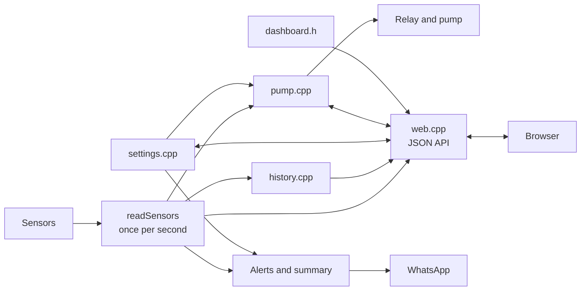

# Smart Garden: IoT garden with an ESP32

Project report (English version)

| | |
| --- | --- |
| Project | Horta IoT com Arduino: supervisão automatizada para plantas saudáveis |
| Subject | Projeto Integrado (Integrated Project) |
| Teacher | Fernando Barros |
| Course | CTeSP in Informatics, Academia de Ensino Superior de Mafra (AESM) |
| Academic year | 2022/2023 |
| Authors | Tiago Cabaça (81744) and Francisco Diniz (81809) |

The Portuguese report with the full progress log is in [project-report.pt.docx](project-report.pt.docx). This document describes the same project in English and follows the final code in `firmware/esp32_smart_garden/`.

## 1. Summary

We build an IoT garden that supervises a plant and waters it without human help. An ESP32 reads air temperature and humidity, light, soil moisture and the water level of the tank. It switches a pump through a relay when the soil is dry, sends WhatsApp alerts when something is wrong and serves a live web dashboard with status cards, charts of the last three hours, pump controls and editable settings. The result is a small system that keeps a plant healthy while its owner is away and that the owner can follow and control from a phone.

## 2. Problem

Plants die from too little or too much water, and from temperatures and light levels that nobody notices. Checking them every day is hard for people who travel or have little time, and over-watering rots the roots just as much as dry soil harms the plant. The system must therefore:

- measure the conditions of the plant continuously;
- water only when the soil needs it and stop before the soil is soaked;
- warn the owner remotely when a condition is outside the ideal range;
- show the current state and its recent history in a place the owner can reach from the network;
- let the owner water by hand and change the limits without reprogramming the board.

## 3. Goals and requirements

| Id | Requirement |
| --- | --- |
| R1 | Read temperature, air humidity, light intensity, soil moisture and tank level |
| R2 | Switch the water pump automatically from the soil moisture |
| R3 | Never run the pump without water, and never run it for too long |
| R4 | Send WhatsApp alerts for adverse conditions and sensor failures, each one once per event |
| R5 | Serve a dashboard that updates itself, shows the history and is usable on a phone |
| R6 | Keep working when Wi-Fi is not available and reconnect automatically |
| R7 | Keep Wi-Fi and WhatsApp credentials out of the source code |
| R8 | Allow manual watering from the dashboard, always under the safety rules |
| R9 | Allow the thresholds to be changed from the dashboard, validated and kept after a restart |
| R10 | Allow firmware updates over Wi-Fi and reach the board by name |
| R11 | Fit comfortably in the memory of a standard ESP32 DevKit |
| R12 | Be testable without the hardware |

## 4. Architecture and hardware

### 4.1 Components

| Part | Function |
| --- | --- |
| ESP32 development board | Controller, Wi-Fi and web server |
| DHT11 | Air temperature and humidity |
| KY-018 | Light intensity (LDR module) |
| Soil moisture sensor | Soil humidity, analog |
| Contactless liquid level sensor | Detects water in the tank from outside the tank, digital |
| Relay module | Switches the pump |
| Water pump and tank | Waters the plant |

### 4.2 Wiring

| ESP32 pin | Component |
| --- | --- |
| GPIO18 | DHT11 data |
| GPIO19 | Relay input |
| GPIO34 | KY-018 analog output (ADC1) |
| GPIO35 | Liquid level sensor digital output |
| GPIO32 | Soil moisture analog output (ADC1) |

The analog sensors use ADC1 pins because they keep working while Wi-Fi is on. The ESP32 ADC is 12 bit (0 to 4095) with a 3.3 V range.

### 4.3 Software structure

The sketch folder has one main file and several tabs, each with one job:

| File | Role |
| --- | --- |
| `esp32_smart_garden.ino` | `setup()`, `loop()`, sensor reading, WhatsApp sending and the alert rules |
| `config.h` | Pins, calibration constants, intervals, build target (real board or simulator) |
| `readings.h` | The `Readings` structure with the last sensor values, shared by every module |
| `history.cpp` | Ring buffer with the last 180 samples |
| `settings.cpp` | Thresholds, loaded from and saved to flash, with validation |
| `pump.cpp` | Pump state machine with auto and manual mode, the only code that writes to the relay |
| `web.cpp` | Web server, JSON API and the answer for the dashboard |
| `dashboard.h` | The dashboard page (HTML, CSS and JavaScript) stored in flash |
| `services.cpp` | mDNS name, over-the-air updates and the NTP clock |
| `summary.cpp` | Daily statistics and the optional daily WhatsApp summary |

### 4.4 Resource budget

The ESP32 DevKit has about 520 KB of RAM, of which roughly 300 KB are free for the program when Wi-Fi is running, and 4 MB of flash with a program partition of about 1.3 MB when over-the-air updates are enabled. The design choices that keep the system small are:

- The dashboard is a constant in flash and is sent with `send_P`, so the page never exists in RAM. Chart.js is loaded by the browser from a CDN and is not stored on the board.
- The JSON answers are written with `snprintf` into fixed buffers (480 bytes for the readings) and the history is streamed in chunks of 256 bytes. There is no JSON library and no large `String`.
- The history uses 8 bytes per sample (temperature, humidity and soil as scaled 16 bit integers, light and flags in one byte each), so 180 samples need 1440 bytes for the last three hours.
- The WhatsApp request is the only blocking call, because the TLS handshake needs a lot of memory. It never runs inside a web request and two sends are kept at least 5 seconds apart.
- The GitHub Actions workflow prints the program size and the global RAM use of every compile and fails above 90 % of the program partition.

| Measure | Value |
| --- | --- |
| Program storage | to be filled from the first CI run |
| Global variables | to be filled from the first CI run |
| Free heap and lowest free heap while running | shown in the footer of the dashboard and in `/api/readings` (`heap_free`, `heap_min`) |

## 5. Implementation

### 5.1 Sensors

Every second `readSensors()` stores the soil humidity, tank state, air humidity, temperature and light intensity in the shared `Readings` structure. The light value is mapped from the ADC range to 0 to 100 %. The soil voltage is `raw * 3.3 / 4095`, and the percentage is `(voltage - soilVoltageDry) / soilVoltagePerPercent`. The two constants describe the sensor curve and are adjusted for the sensor in use. A soil value outside 0 to 100 % means the sensor is broken or unplugged.

A DHT11 reading that is not a number (`NaN`) means the sensor did not answer. The temperature and humidity alerts are skipped in that cycle, one alert reports the failure and the dashboard shows "--".

### 5.2 Pump control

`pump.cpp` is a small state machine called once per second. It is the only code that writes to the relay pin, so every safety rule is in one place.

| Rule | Value |
| --- | --- |
| Automatic start | Auto mode, soil valid and below the dry limit, tank has water and no pause active |
| Automatic stop | Soil above the wet limit, tank empty, soil value invalid, or maximum run time reached |
| Manual run | Any mode, 1 second up to the maximum run time, refused when the tank is empty or the time is above the maximum |
| Manual stop | The chosen time ends, the tank becomes empty, the maximum run time is reached or the user presses stop |
| Pause after an automatic safety stop | Pause time (60 s by default), the automatic mode cannot start the pump during it |

The defaults are 30 % and 70 % for the soil limits, 30 s for the maximum run time and 60 s for the pause. In manual mode the automatic start is off, so the pump only runs when the owner asks for it. After a safety stop an alert asks the owner to check the soil sensor and the tank.

### 5.3 Settings

The thresholds live in the `Settings` structure. At start `settingsBegin()` loads them from the flash key-value store (`Preferences`, namespace `garden`) and falls back to the defaults of `config.h` when a key is missing or the stored set is not valid. `settingsCheck()` validates a whole set:

| Setting | Allowed values |
| --- | --- |
| Soil dry and wet limit | 0 to 100 %, dry at least 5 below wet |
| Temperature min and max | -10 to 60 C, min at least 2 below max |
| Air humidity min and max | 0 to 100 %, min at least 5 below max |
| Maximum pump run | 5 to 120 s |
| Pause after a safety stop | 10 to 600 s |
| Daily summary hour | 0 to 23 |

`settingsSave()` writes only the values that changed, to spare the flash.

### 5.4 History

`history.cpp` keeps the last 180 samples in a ring buffer, one per minute, so the dashboard can draw the last three hours. A sample is 8 bytes (scaled integers and a flag byte that records the pump state and the validity of the DHT and soil readings). The buffer is in RAM and starts empty after a restart.

### 5.5 Alerts and daily summary

Alerts go to one WhatsApp number through CallMeBot. The flags `lowTempSent`, `highTempSent` and the similar ones make each alert go out once while the condition lasts, and they are cleared when the value returns to the normal range. A flag is only set after the message is accepted by the server, so a message lost because of the network is attempted again after 30 seconds. The limits come from the settings.

| Alert | Condition |
| --- | --- |
| Temperature too low / too high | Below the minimum / above the maximum |
| Air humidity too low / too high | Below the minimum / above the maximum |
| Tank empty | Soil is dry and there is no water |
| Soil sensor not working | Soil value outside 0 to 100 % |
| Temperature and humidity sensor not working | DHT11 returns no value |
| Pump safety stop | Maximum run time reached |

When the daily summary is switched on and the clock is set, one message per day is sent at or after the chosen hour with the minimum, maximum and average temperature, the average soil humidity, the seconds the pump ran and the tank state. The statistics are kept in static variables and start again after each summary.

### 5.6 Web server, API and dashboard

The ESP32 serves a single page at `/` and a JSON API under `/api`:

| Route | Method | Use |
| --- | --- | --- |
| `/api/readings` | GET | Readings, pump state, uptime, Wi-Fi signal, free heap |
| `/api/history` | GET | The history as arrays, streamed in chunks |
| `/api/settings` | GET, POST | Read or change the settings, `reset=1` restores the defaults |
| `/api/pump` | GET, POST | Pump state, `mode`, `run`, `stop` |

A POST with a value outside the limits answers `400` and changes nothing. A pump command that breaks a safety rule answers `409`. The dashboard polls `/api/readings` every 3 seconds and `/api/history` every minute, so the page never reloads. It has a status banner that lists the problems, cards with a gauge for the soil, a tank icon, temperature, humidity and light with colours for ok, warning and alert, the pump card with the mode switch and the timed run buttons, two charts of the last three hours (Chart.js), a collapsible settings form that checks the same limits as the board before it saves, and a footer with uptime, signal and memory. The layout is a CSS grid that goes from four columns to two on a phone, and the colours follow the light or dark theme of the device. The icons are inline SVG.

### 5.7 Services

Once the Wi-Fi is connected `services.cpp` starts three things: mDNS, so the dashboard answers on `http://smart-garden.local`; ArduinoOTA, so new firmware can be uploaded over Wi-Fi with a password from `secrets.h` (the pump is stopped when an update starts); and the NTP clock with the Lisbon time zone, which the daily summary needs. mDNS is started again after a Wi-Fi reconnect.

### 5.8 Timing and connectivity

`loop()` has no blocking delay. The web server runs on every pass and the readings run once per second, using `millis()`. If Wi-Fi is lost the sketch tries to reconnect every 10 seconds without blocking, while the pump logic keeps running.

### 5.9 Simulation and continuous integration

The `wokwi` folder has a Wokwi project of the garden: an ESP32 DevKit, a DHT22 in place of the DHT11 (Wokwi has no DHT11), two potentiometers for the light and soil sensors, a slide switch for the tank sensor, a relay module and an LED for the pump, wired to the same pins as the real board. The sketch is built for it with the flag `-DWOKWI_SIMULATION`, which selects the DHT22, the `Wokwi-GUEST` network, a faster history and prints the alerts instead of sending them.

The workflow `.github/workflows/ci.yml` runs on every push. It compiles the sketch for `esp32:esp32:esp32` with arduino-cli, prints the program size and the RAM use, fails when the program is above 90 % of the program partition, builds the simulator firmware and runs the dashboard checks with Node.js.

## 6. Data

The system has no database. It keeps the last readings and the history of the last three hours in memory, and the settings in flash. The readings are also printed on the Serial monitor at 9600 baud.

## 7. Project management

We planned the work in MS Project (the initial plan is in `schedule-original.mpp`, the adjusted schedule in `schedule-edited.mpp`). The progress log in the Portuguese report has six entries:

| Date (2023) | Progress |
| --- | --- |
| 27 January | Planning finished: objectives, materials, schedule, components bought and checked |
| 30 January | Materials ready, assembly of the electronic components starts |
| 6 February | Assembly, sensor configuration and tests finished, sensor data collected, work on pump control starts |
| 15 February | Pump control, WhatsApp alerts, data processing algorithms and the web page finished |
| 27 February | Delays because of sensor configuration and assembly adjustments, and a communication problem that needs some components replaced |
| 6 March | Web page integration, field tests, stress and long-duration tests, adjustments and final test finished; finishing the project and the documentation continues |

## 8. Testing

The tests of the schedule are field tests of the whole system, identification of problems, a stress test, a long-duration test and a final test. We check that:

- every sensor gives plausible values on the Serial monitor;
- the pump starts with dry soil and stops with wet soil or an empty tank;
- a manual run stops after the chosen time, and is refused with an empty tank;
- the alerts reach the phone once per event;
- the dashboard shows the same values as the Serial monitor on a computer and on a phone;
- a limit changed on the dashboard is still there after the board restarts;
- the board recovers after the Wi-Fi network goes away and comes back.

The dashboard and the API are also tested without the board. `tools/preview/server.js` is a Node.js program that serves the real `dashboard.h` page and behaves like the firmware (same JSON, same validation, same pump rules), and `tools/preview/check.js` runs against it. It checks the size of the page, the JavaScript syntax, that every element id used by the script exists, the fields and types of the readings and history, the validation of the settings, the manual pump rules and the refusal with an empty tank. The screenshots in the README come from this preview. The firmware itself is compiled by the workflow and can be run in the Wokwi simulation.

## 9. Difficulties

- The initial configuration of the components and the calibration of the sensors take longer than planned.
- A communication problem between components forces us to replace some of them, which delays the schedule.
- The ESP32 ADC works with 3.3 V, so the analog sensors and the voltage conversion have to use that range.
- The soil sensor curve differs between sensors, so its two calibration constants must be measured.
- Without limits, a faulty sensor or an empty tank could keep the pump running, so the sketch has the safety rules of section 5.2.
- The memory of the ESP32 is limited, and a page built from Strings or a JSON library would use too much of it. The dashboard is stored in flash, the JSON is written into fixed buffers and the WhatsApp request is kept out of the web handlers.
- The WhatsApp request blocks the loop for the time of the network call, so the sketch sends only one at a time and keeps them apart.

## 10. Conclusions

The project shows that an ESP32 with a few cheap sensors can supervise a plant, water it only when needed, warn its owner remotely and show and control the state from a web dashboard. The main lessons are the importance of calibrating the sensors, protecting the pump with simple safety rules in one place, handling the failure of every sensor and of the network, and keeping the memory use of the board under control. Possible extensions are more sensors (for example CO2), more pumps for several plants and a database to keep the history for longer than three hours.
